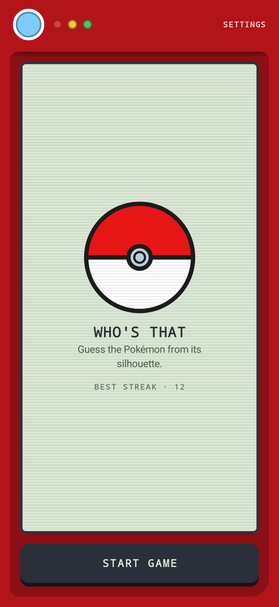
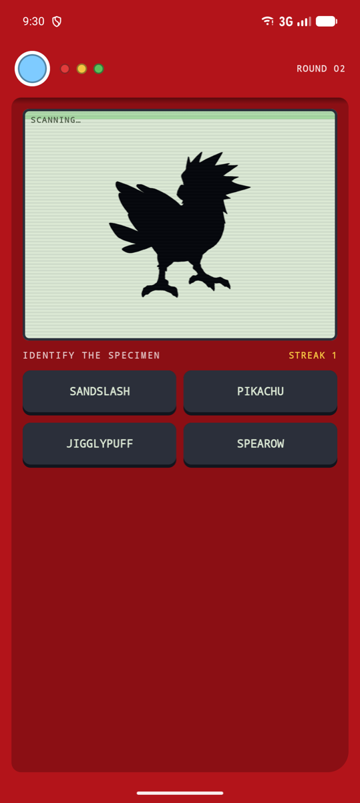
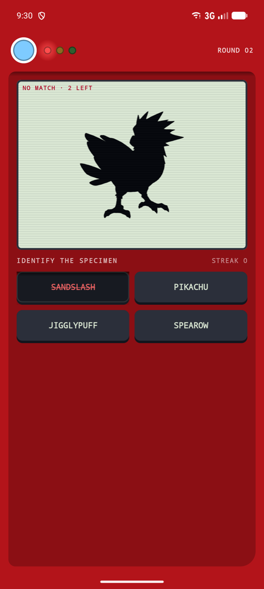
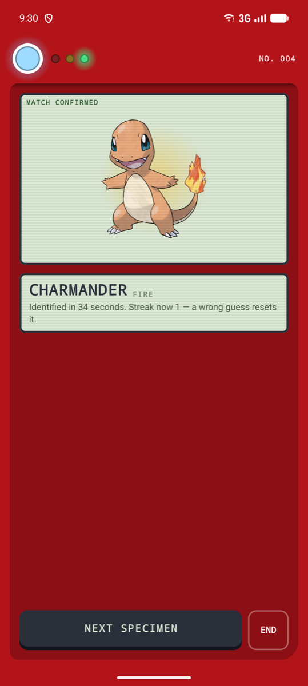
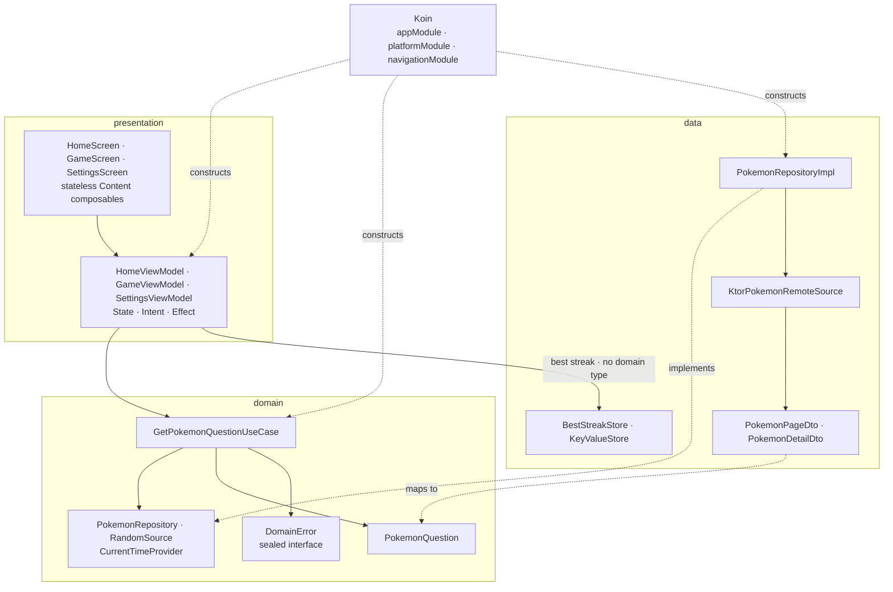
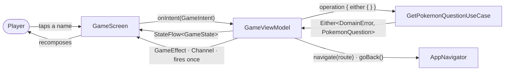
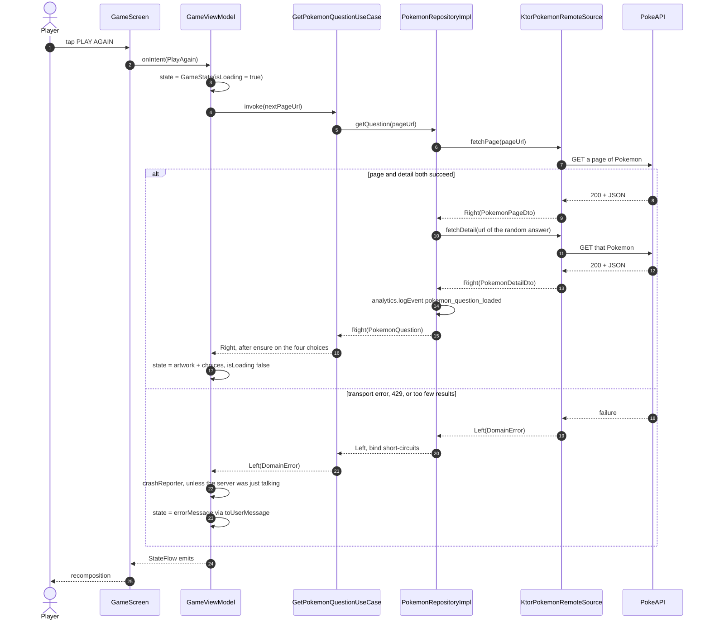
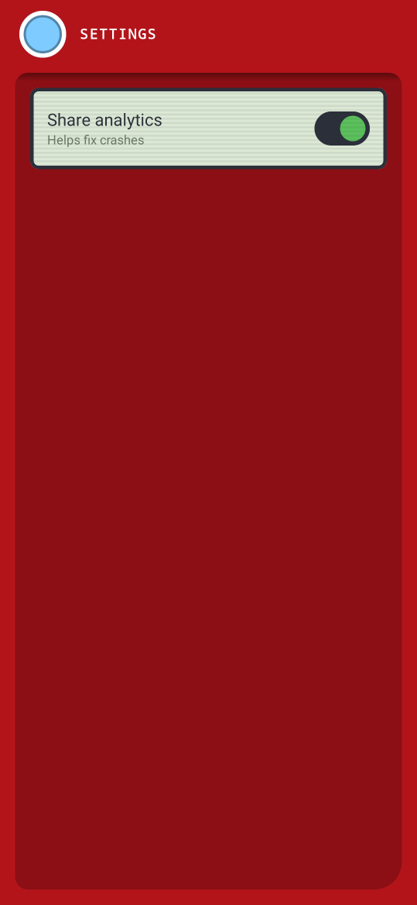

# PokeDex Game

Guess the Pokemon from its silhouette. A Compose Multiplatform app targeting **iOS and Android** from
one shared Kotlin codebase — a single `composeApp` module holds the shared code *and* is the Android
application.

**Stack:** Compose Multiplatform 1.11 · Kotlin 2.3 · Koin (DI) · Ktor 3 (networking) · Navigation 3 ·
Arrow (typed errors) · Coil 3 (images) · Firebase Analytics + Crashlytics (native per platform,
opt-in) · clean architecture (data / domain / presentation) · MVI presentation.

## Screenshots

The whole UI is a handheld Pokédex — red shell, hinged screen bezel, scanline glass, LED cluster and
monospaced readouts. One round, start to finish:

<table>
  <tr>
    <td width="25%"></td>
    <td width="25%"></td>
    <td width="25%"></td>
    <td width="25%"></td>
  </tr>
  <tr>
    <td align="center"><b>Home</b><br><sub>Start, and your best streak</sub></td>
    <td align="center"><b>Identify</b><br><sub>Silhouette + four choices</sub></td>
    <td align="center"><b>No match</b><br><sub>Wrong guesses burn a life</sub></td>
    <td align="center"><b>Match confirmed</b><br><sub>Artwork, type, streak</sub></td>
  </tr>
</table>

<!-- cmp-diagrams:start -->
## Architecture

Clean layers, one shared Kotlin module. **Almost every arrow points inward** — `domain` imports
nothing from `data`, `presentation` or any platform, and `data` depends on `domain` only by
implementing its contracts. Koin is the one thing that knows all three. The single exception is drawn
below: the ViewModels reach `BestStreakStore` directly, because one persisted integer never earned a
domain repository.



### The MVI loop

A screen is a pure function of `State` plus an `onIntent` callback. All state lives in the ViewModel.
Navigation is not an `Effect` — it goes straight through `AppNavigator`, because navigating is what
the player asked for. `Effect` is reserved for genuinely one-shot things: the buzz on a wrong guess.



### One round, both outcomes

Expected failures are values, not exceptions. `network/NetworkCall.kt` is the only place a
`Throwable` becomes a `Left`, and `bind()` short-circuits everything above it — note that the second
request and the analytics event simply never run when the first one fails.



More diagrams — source sets, navigation, the Koin graph, the error model and the test tiers — are in
[docs/architecture.md](docs/architecture.md).
<!-- cmp-diagrams:end -->

## The feature, through every layer

Three screens — **Home** (start), **Game** (the round), **Settings**. One round flows through the
whole stack: the screen dispatches an `Intent` → `GameViewModel` calls `GetPokemonQuestionUseCase` →
which calls `PokemonRepository` → which calls a Ktor-backed `PokemonRemoteSource` twice (a page of
Pokemon, then the chosen one's detail) and logs one analytics event (`pokemon_question_loaded`) on
the way. Coil loads the artwork and a colour filter turns it into the silhouette.

`https://pokeapi.co/api/v2/pokemon/` is the only literal URL in the app — every later page comes
from the API's own `next` cursor, which the `GameViewModel` keeps out of `GameState` because the
player never sees it. Nothing above the data layer knows PokeAPI exists.

**MVI, one folder per feature.** `GameScreen` / `GameState` / `GameIntent` / `GameEffect` /
`GameViewModel`. State re-emits; effects (`WrongAnswerFeedback`) go through a `Channel` so they fire
exactly once. `Home` deliberately has no `HomeState` or `HomeEffect` — the start screen renders
nothing that varies — but it still has a ViewModel, because navigation is a decision.

**`RandomSource`** is injected rather than called inline: it decides which Pokemon is the answer and
shuffles the choices, so a test can pin the round. **`CurrentTimeProvider`** (plus the `TimeZone`) is
the clock seam and is wired through `platformModule` with a `FixedCurrentTimeProvider` fake ready in
`commonTest`; nothing consumes it yet, but it is there so no future feature reaches for
`Clock.System.now()` directly.

### Settings

<table>
  <tr>
    <td width="30%"></td>
    <td valign="top">

`SettingsViewModel` persists the analytics opt-in through the `KeyValueStore` expect/actual
(SharedPreferences on Android, `NSUserDefaults` on iOS). Note that today the preference is only
stored and re-read — the `Analytics` implementations do not consult it yet, so flipping the switch
does not currently mute event logging.

  </td>
  </tr>
</table>

## Error handling

Anything that can fail for a reason the app understands returns `Either<DomainError, T>`. `DomainError`
(`domain/error/DomainError.kt`) is a sealed interface enumerating every failure the app models, and
`toUserMessage` is the single place that decides what each one says to the user — its `when` is
exhaustive, so adding a case forces you to word it.

Exceptions are reserved for bugs and for cancellation. The one place a `Throwable` becomes a value is
`network/NetworkCall.kt`, at the data boundary. Note the ordering there: Ktor 3's
`ContentConvertException` **is** an `IOException`, so it is matched first — otherwise an unparseable
response would tell the user to check their connection instead of being reported as the bug it is.
This mapping only works because `expectSuccess = true` is set on the client; without it a 4xx is not
an exception at all and `body<T>()` fails with a confusing serialization error.

Compose failures with the Raise DSL rather than by branching:

```kotlin
suspend operator fun invoke(pageUrl: String?): Either<DomainError, PokemonQuestion> = either {
    val question = repository.getQuestion(pageUrl).bind()   // short-circuits on Left
    ensure(question.choices.size == CHOICE_COUNT) { DomainError.EmptyResponse }
    question
}
```

Two helpers carry the rest of the policy:

- **`OperationViewModel.operation()`** is the only way work leaves a ViewModel. It settles
  cancellation, crash reporting, and user-facing wording in one place — and it deliberately does
  *not* report `RateLimited` or `EmptyResponse`, because those are the server talking, not defects.
- **`bestEffort()`** (`domain/error/BestEffort.kt`) is for survivable failures such as a preference
  read: the caller continues with a fallback, but the failure is still recorded. It uses
  `Either.catch`, not `runCatching`, so `CancellationException` is rethrown rather than swallowed.

## Navigation

Navigation 3, with the back stack owned by a Koin `Navigator` rather than by composition. Routes are
a `@Serializable` sealed `AppRoute : NavKey`; `navigationModule` maps each one to its screen through
Koin's `navigation<Route> { }` DSL, so there is no growing `when` in the nav host.

Two things in `AppNavDisplay` are load-bearing and easy to delete by accident:

- **`entryDecorators` must include both** `rememberSaveableStateHolderNavEntryDecorator()` and
  `rememberViewModelStoreNavEntryDecorator()`. Without them a destination gets no `ViewModelStore`,
  `koinViewModel()` returns a fresh ViewModel on every recomposition, and the game refetches a
  Pokemon on every frame.
- **`Navigator.backStack` is typed `SnapshotStateList<Any>`, not `AppRoute`.** `koinEntryProvider()`
  builds an `(Any) -> NavEntry<Any>`; narrowing the list breaks type inference. The `AppNavigator`
  interface stays typed, so callers keep route safety.

The stack survives configuration changes but **not process death** — Android may restore a
backgrounded app at Home. That is accepted here: a three-screen game with no deep stack loses nothing
but the current round. `navigation/AppNavConfig.kt` already teaches serialization about every route
(reflection-based serialization does not exist on Kotlin/Native), so persisting the stack later is a
change in one place.

## Builds out of the box — Firebase is opt-in

This project **builds and runs with no Firebase setup**. Firebase is off by default
(`firebase.enabled=false` in `gradle.properties`): analytics and crash reporting go to logcat, and no
config files are required.

### Enabling Firebase (when you're ready)

1. Set `firebase.enabled=true` in `gradle.properties`.
2. **Android** — download `google-services.json` (Firebase console → Project settings → your Android
   app) and place it at `composeApp/google-services.json`, replacing the `.PLACEHOLDER`.
3. **iOS** — in Xcode: File → Add Package Dependencies → `https://github.com/firebase/firebase-ios-sdk`,
   add **FirebaseAnalytics** and **FirebaseCrashlytics** to the `iosApp` target, uncomment the
   `// ENABLE FIREBASE` blocks in `iosApp/iosApp/iOSApp.swift`, and add your `GoogleService-Info.plist`
   at `iosApp/iosApp/`, replacing the `.PLACEHOLDER`.

With the flag on, `composeApp/build.gradle.kts` applies the google-services/Crashlytics plugins and
swaps the `androidNoFirebase` source set for `androidFirebase`; with it off it compiles a logcat
no-op. Common code only ever sees the `Analytics` / `CrashReporter` interfaces, so it is identical
either way. On iOS the Kotlin side talks to `AnalyticsBridge` / `CrashReporterBridge`, which Swift
implements — Kotlin never links the Firebase SDK.

Both real config files are git-ignored; only the `.PLACEHOLDER` copies are meant to be committed.

## Project layout

- `composeApp/` — the shared KMP module, and the Android application.
  - `commonMain` — `domain/`, `data/`, `presentation/` (MVI + `theme/` + `common/`), `navigation/`,
    `di/`, `network/`, `analytics/`.
  - `androidMain` — Android entry point (`MainApplication` starts Koin, `MainActivity` hosts
    `App()`), the manifest, and platform actuals.
  - `androidFirebase` / `androidNoFirebase` — the two analytics variants, selected by `firebase.enabled`.
  - `iosMain` — `MainViewController`, the Koin entry point, and the Firebase bridge interfaces.
  - `commonTest` — domain, data, navigation and state-production tests, plus the shared `fake/` package.
  - `androidUnitTest` — `component/`, `feature/`, the Koin graph test, `robolectric.properties`, and
    the committed Roborazzi goldens in `screenshots/`.
- `iosApp/` — the SwiftUI host (`PokeDex.xcodeproj`).
- `fastlane/` — lives at the repo root; it used to sit inside the deleted `androidApp` module.

## Run on Android

Open the project root in **Android Studio**, let Gradle sync, run the `composeApp` configuration.
Or:

```bash
./gradlew :composeApp:installDebug
```

`minSdk 24`, `targetSdk 35`, `compileSdk 36` — 36 is required because Compose 1.11 pulls
androidx.activity 1.12.x, which will not compile against anything lower.

## Run on iOS

1. Open `iosApp/PokeDex.xcodeproj` in **Xcode**.
2. The "Run Script" build phase already invokes
   `./gradlew :composeApp:embedAndSignAppleFrameworkForXcode`, and the framework search paths point at
   `composeApp/build/xcode-frameworks/…`. Without that phase, `import ComposeApp` won't resolve.
3. Select a simulator and run.

The shared framework is `baseName = "ComposeApp"`, `isStatic = true`, with an explicit
`bundleId` binary option. Renaming it means editing the Xcode project too.

Only **`iosArm64`** (devices) and **`iosSimulatorArm64`** (Apple-Silicon simulators) are built.
`iosX64` is deliberately absent: Compose Multiplatform dropped it in stable 1.11.0, so adding it back
fails to resolve. Intel Macs cannot run the simulator build.

## Tests

```bash
./gradlew :composeApp:allTests            # domain, data, navigation, state production (all targets)
./gradlew :composeApp:testDebugUnitTest   # component + feature tiers + the Koin graph test
./gradlew recordRoborazziDebug            # write the screenshot baseline — run once, then commit
./gradlew verifyRoborazziDebug            # fail if the UI drifts from the goldens
./gradlew koverVerify                     # 90% coverage gate on the logic layers
```

Goldens are committed to `composeApp/src/androidUnitTest/screenshots/` — deliberately in the source
tree, not the Gradle default under `build/`, which is git-ignored and would leave every CI run with
nothing to compare against.

The regression tier auto-generates one screenshot test per `@Preview`. **To cover a new screen state,
add a `@Preview` for it** — no test code required. Composables are excluded from coverage on purpose,
so a screen without previews is a screen with no UI tests. Previews pass a `null` artwork URL so the
placeholder Pokeball renders and no golden depends on the network.

Three test-infrastructure facts worth knowing before you add tests:

- **The UI tiers are debug-only.** `androidx.compose.ui:ui-test-manifest` supplies the
  `ComponentActivity` that `runComposeUiTest` launches, and it is a `debugImplementation` because it
  injects an activity into the merged manifest. The release unit-test variant is therefore disabled
  in `composeApp/build.gradle.kts`.
- **Transport tests run on a real dispatcher.** `runTest`'s virtual clock skips idle time instantly,
  which makes Ktor's `HttpTimeout` fire the moment a call suspends. See `networkTest` in
  `KtorPokemonRemoteSourceTest`.
- **`robolectric.properties` is not boilerplate.** It pins `application=TestApplication` (so the
  generated screenshot tests don't start Koin twice and die on the second preview), `sdk=34`,
  `graphicsMode=NATIVE` (Compose draws through Skia — the legacy mode yields empty canvases), and a
  `w480dp-h1600dp` display, because Robolectric's 320x470dp default pushes content below the fold.

## CI and release builds

Two GitHub workflows, both thin triggers around a Fastlane lane so the same checks run locally:

| Workflow | Fires on | Does |
| --- | --- | --- |
| `ci.yml` | PRs to `main`, pushes to `main` | Compiles, runs the suite, verifies the goldens, checks coverage |
| `android-firebase-distribution.yml` | `android-v*` tags, manual | Builds an APK and ships it to Firebase App Distribution |

```bash
bundle exec fastlane android ci           # exactly what CI runs
bundle exec fastlane android screenshots  # re-record the Roborazzi goldens
bundle exec fastlane android beta         # build, then upload to App Distribution ("testers")
bundle exec fastlane ios ci               # compile the Kotlin/Native framework
```

Push an `android-v1.0.1` tag and testers get that build. The tag is the single source of truth for
the version: Fastlane derives `versionName` `1.0.1` and `versionCode` `10000010` from it and passes
them to Gradle as `-PversionCode` / `-PversionName`, which default to `1` / `1.0` without them. An
untagged distribution run is refused rather than shipped.

Signing is read from `keystore.properties` (git-ignored — copy `keystore.properties.PLACEHOLDER`) or,
in CI, from `ANDROID_KEYSTORE_FILE` / `ANDROID_KEYSTORE_PASSWORD` / `ANDROID_KEY_ALIAS` /
`ANDROID_KEY_PASSWORD`. If neither is present the release build is left unsigned — so debug builds,
tests and CI checks keep working with no secrets, and the distribution lane builds the *debug*
variant instead, since an unsigned release APK cannot be installed.

See **[DISTRIBUTION.md](DISTRIBUTION.md)** for the secrets each workflow needs and how to switch to
signed release builds.

## Versions

All versions are pinned in `gradle/libs.versions.toml`. Bump there; keep Kotlin and Compose
Multiplatform aligned, since the Compose compiler ships with Kotlin. Three pins carry non-obvious
constraints and are commented in the catalog:

- **Arrow 2.2.2.1, not 2.2.3** — 2.2.3's Kotlin/Native klibs are ABI 2.4.0 and a Kotlin 2.3.0 compiler
  refuses to read them. Android compiles either way; only the iOS targets break.
- **Roborazzi and ComposablePreviewScanner are peers** — 1.59.0 + 0.9.2 is the pair verified here.
  Mismatch them and every generated preview test dies with the same `NoSuchMethodError`.
- **kotlinx-datetime 0.7.1, not 0.6.1** — a transitive dependency requires 0.7.x and Gradle takes the
  highest, so pinning lower only makes the catalog disagree with the compiler.
