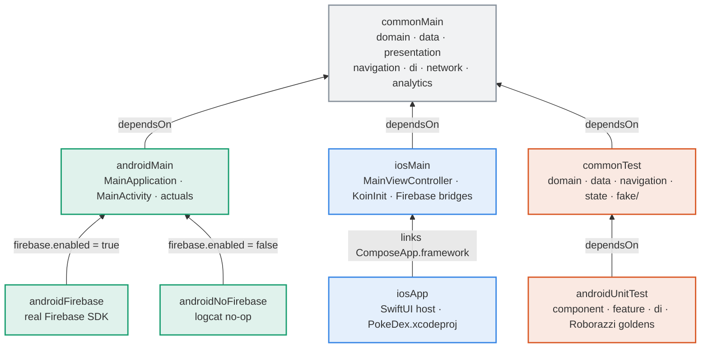
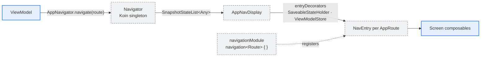
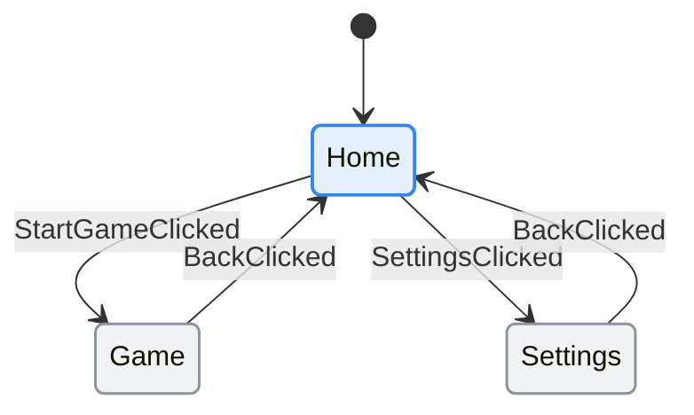
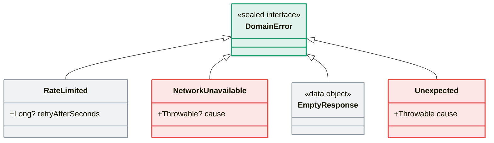
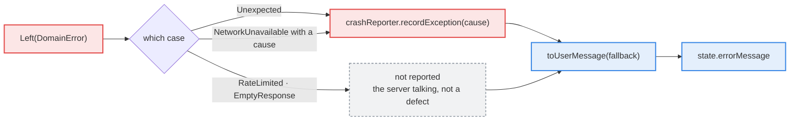
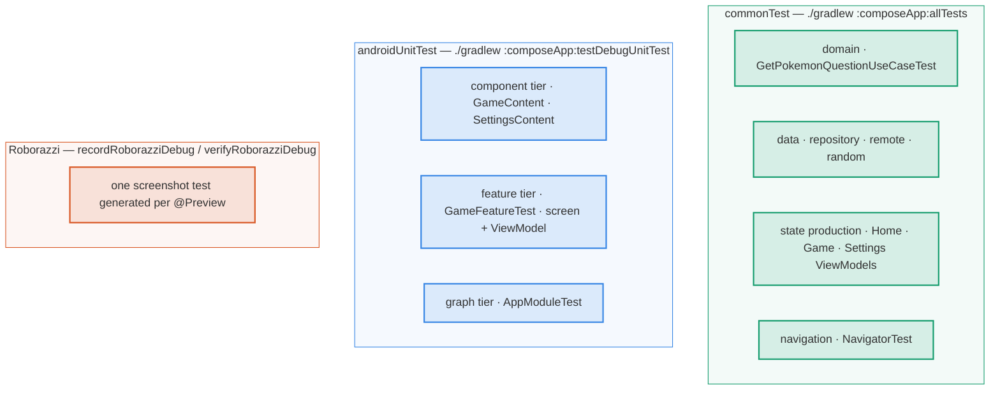

# Who's That — architecture

Diagrams for the parts of the project you only need once you're editing it. The layer diagram, the
MVI loop and the request sequence live in the [README](../README.md).

Where these diagrams and the code disagree, **the code wins** — fix the diagram, and see the
regeneration table at the bottom for which one to redraw.

**Reading the colours.** The layer palette is the same one the README uses: 🔵 presentation ·
🟢 domain · 🟠 data · ⚪ dashed grey cross-cutting · 🔴 failure path. Three diagrams here are not
about layers — source sets, the route stack and the test tiers — so they re-use the same three hues
with their own meaning, stated under each. Grouping and labels carry the same information, so none
of it depends on seeing colour. The hues are fixed hex rather than theme-aware, chosen to clear
contrast and colour-blind separation against **both** GitHub's light and dark surfaces; node text is
left to the theme so it stays legible either way.

## Source sets and the Firebase variants

One shared module, `composeApp`, which is both the shared KMP code *and* the Android application.
`firebase.enabled` in `gradle.properties` picks exactly one of the two Android analytics source sets;
**common code is identical either way**, because both compile against the same `Analytics` /
`CrashReporter` interfaces.

Here the coding is by **target**, not by layer: 🟢 Android · 🔵 iOS · 🟠 test · ⚪ shared.

On iOS the Kotlin side never links the Firebase SDK at all: `IosAnalytics` and `IosCrashReporter`
call the `AnalyticsBridge` / `CrashReporterBridge` interfaces, which Swift implements in `iosApp`.

## Navigation

The back stack is a Koin singleton, not a `NavController`. ViewModels depend on the narrow
`AppNavigator` interface (`navigate` / `goBack`); only `AppNavDisplay` sees the list itself.

`Navigator` is bound to **both** `Navigator` and `AppNavigator` in `navigationModule`: the nav host
needs the concrete `backStack`, ViewModels need only the interface.

Routes are a `@Serializable` sealed `AppRoute : NavKey`. None of them carry arguments — the API page
cursor that drives "play again" is state `GameViewModel` owns, not something the user navigates to.

🔵 is the one route with `isTopLevel = true`; the grey pair are pushed onto the stack.

`AppRoute.Home` is the only route with `isTopLevel = true`, so navigating to it clears the stack
instead of piling destinations up. `Navigator.goBack()` refuses to pop the last entry — a double tap
would otherwise leave `NavDisplay` with nothing to render.

The stack survives configuration changes but **not process death**: Android may restore a
backgrounded app at Home. Accepted here, because a three-screen game with no deep stack loses nothing
but the current round.

## Dependency injection

```mermaid
flowchart TB
    INIT["initKoin()<br/>MainApplication · doInitKoinIos()"]
    APPM["appModule"]
    PLATM["platformModule<br/>expect / actual"]
    NAVM["navigationModule"]

    INIT --> APPM
    INIT --> PLATM
    INIT --> NAVM
    APPM --> VMS["HomeViewModel · GameViewModel<br/>SettingsViewModel"]
    APPM --> UCS["GetPokemonQuestionUseCase"]
    APPM --> REPOS["PokemonRepositoryImpl<br/>KtorPokemonRemoteSource · BestStreakStore"]
    APPM --> RAND["KotlinRandomSource"]
    APPM --> HTTP["HttpClient"]
    PLATM --> ENGINE["HttpClientEngine<br/>OkHttp · Darwin"]
    PLATM --> KVS["KeyValueStore<br/>SharedPreferences · NSUserDefaults"]
    PLATM --> CLOCK["CurrentTimeProvider · TimeZone"]
    PLATM --> ANA["Analytics · CrashReporter"]
    NAVM --> NAVIGATOR["Navigator<br/>bound as Navigator + AppNavigator"]
    NAVM --> ENTRIES["AppRoute to screen entries"]

    classDef pres fill:#3987e522,stroke:#3987e5,stroke-width:2px
    classDef dom fill:#199e7022,stroke:#199e70,stroke-width:2px
    classDef dat fill:#d9592622,stroke:#d95926,stroke-width:2px
    classDef infra fill:#8b949e1f,stroke:#8b949e,stroke-width:1.5px,stroke-dasharray:4 3
    class VMS pres
    class UCS,CLOCK dom
    class REPOS,RAND,HTTP,ENGINE,KVS dat
    class INIT,APPM,PLATM,NAVM,ANA,NAVIGATOR,ENTRIES infra
```

`platformModule` on Android does `includes(analyticsModule)`, which resolves to whichever variant
source set compiled — the line is identical regardless of the flag.

`initKoin()` never calls `stopKoin()`. Under Robolectric a fresh `Application` is built per test
against Koin's static container; the fix for that lives in `TestApplication` and
`robolectric.properties`, not in the app's startup path.

## The error model

`DomainError` is a sealed interface, so `when` over it is exhaustive — add a case and every site that
words an error stops compiling until it handles the new one. `toUserMessage` is the single place that
decides the wording.

🔴 reaches the crash reporter; ⚪ never does — see the flow below.

`Unexpected` is the deliberate escape hatch for genuine bugs: it carries the `Throwable` so crash
reporting keeps the stack trace, while callers still only ever see a `DomainError`.

Which failures reach the crash reporter is decided once, in `OperationViewModel`:

`network/NetworkCall.kt` is the only place a `Throwable` becomes a `Left`. Its `when` order is
load-bearing: Ktor 3's `ContentConvertException` **is** an `IOException`, so it is matched first —
otherwise an unparseable response would tell the user to check their connection instead of being
reported as the bug it is.

## Test tiers

Coded by **tier**: 🟢 pure logic, no Compose · 🔵 Compose under Robolectric · 🟠 generated screenshots.

The regression tier is generated, not written: **to cover a new screen state, add a `@Preview` for
it**. Composables are excluded from coverage on purpose, so a screen without previews is a screen
with no UI tests. Goldens are committed under `composeApp/src/androidUnitTest/screenshots/` rather
than the Gradle default under `build/`, which is git-ignored and would leave every CI run with
nothing to compare against.

## Regenerating these diagrams

Mermaid is the source of truth — there are no generated images to fall out of date, and a diagram
change diffs as text next to the code change that caused it.

| You changed | Regenerate |
|---|---|
| Added a feature package, use case or repository | layer diagram (README), Koin graph |
| Added an `AppRoute` case or an argument | route state diagram |
| Added a `DomainError` case | error model class diagram, reporting flow |
| Added a platform actual or a Koin module | DI graph, source-set diagram |
| Changed what the game fetches per round | request sequence (README) |
| Flipped `firebase.enabled`, or added a variant | source-set diagram |
